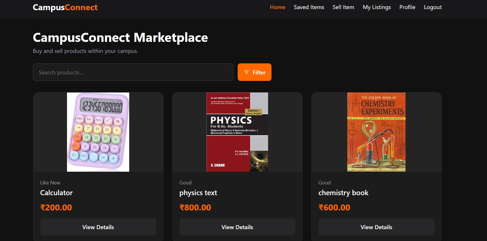
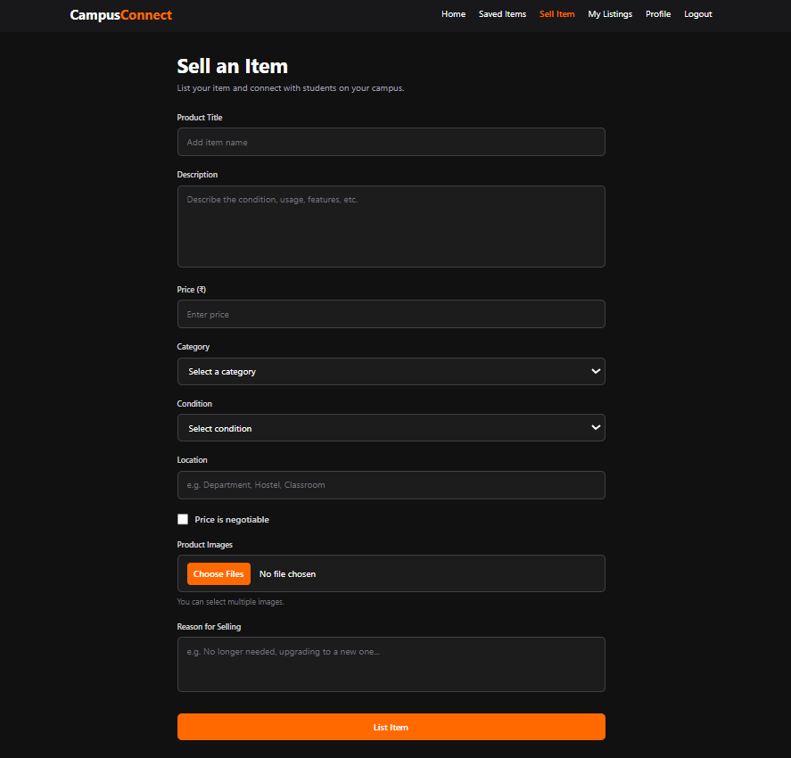
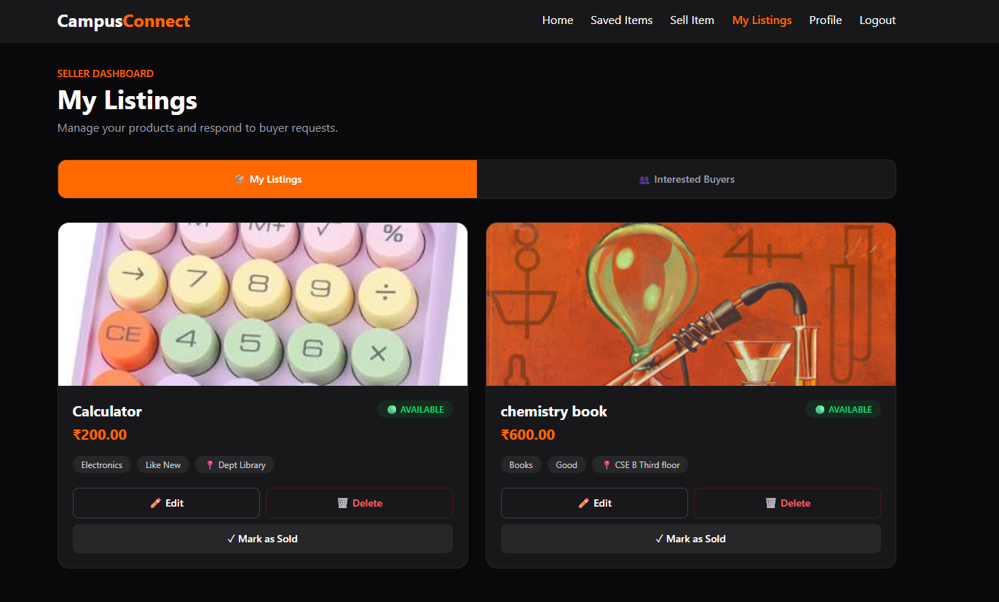

# CampusConnect 🎓

A campus-exclusive student marketplace where students can buy and sell used items within their college community.

## 📸 Screenshots

### 🏠 Home Page
Browse products listed by students, search for items, and discover available products.



### 🛍️ Sell Item Page
Create product listings with descriptions, prices, categories, conditions, locations, and images.



### 📦 My Listings Page
Manage your products, edit or delete listings, and mark items as sold.



## ✨ Features

- Student registration and login
- Browse and search product listings
- Sell items with multiple images
- Filter products
- Save items for later
- View and manage your listings
- Edit and delete listings
- Mark products as sold
- View interested buyers
- Student profile management

## 🛠️ Tech Stack

**Frontend**
- React
- Vite
- Tailwind CSS
- Axios
- React Router

**Backend**
- Python
- Django
- Django REST Framework
- JWT Authentication

**Database**
- PostgreSQL

## 📂 Project Structure

```text
CampusConnect/
├── backend/
│   ├── config/
│   ├── manage.py
│   └── requirements.txt
├── frontend/
│   ├── src/
│   ├── public/
│   └── package.json
├── Screenshots/
│   ├── homepage.png
│   ├── sellitempage.png
│   └── mylistingpage.png
└── README.md
```

## ⚙️ Getting Started

### Prerequisites

- Python
- Node.js and npm
- PostgreSQL
- Git

### 1. Clone the Repository

```bash
git clone https://github.com/AbhijithAJ3/CampusConnect.git
cd CampusConnect
```

### 2. Set Up the Backend

```bash
cd backend
python -m venv venv
```

Activate the virtual environment on Windows:

```powershell
.\venv\Scripts\Activate.ps1
```

Install dependencies:

```bash
pip install -r requirements.txt
```

Create a `.env` file in the `backend/` directory and configure your local Django secret key and PostgreSQL database credentials. Do not commit this file.

Run migrations and start Django:

```bash
python manage.py migrate
python manage.py runserver
```

### 3. Set Up the Frontend

Open a new terminal:

```bash
cd frontend
npm install
npm run dev
```

Open the local URL displayed by Vite in your browser.

## 🔐 Security

- Keep environment variables and secret keys out of Git.
- Configure your own local database credentials.
- Never commit passwords or private credentials.

## 👨‍💻 Author

**Abhijith P Anil**

GitHub: [@AbhijithAJ3](https://github.com/AbhijithAJ3)

---

Built to make buying and selling within the campus community easier.
